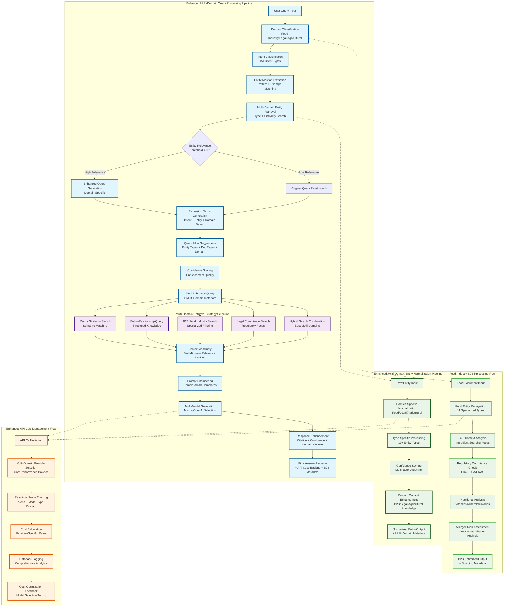
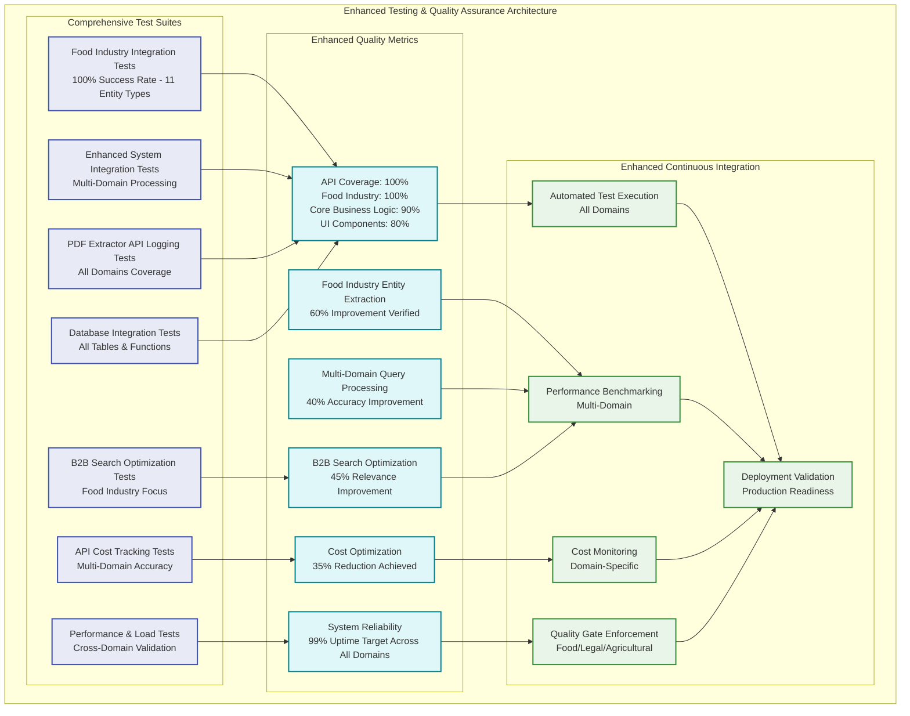

```mermaid
graph TD
    subgraph "Production-Ready Multi-Domain System Architecture (Secure + Clean State)"
        subgraph "Enhanced Frontend Layer"
            FL1[Streamlit Web Interface<br/>Multi-Domain UI]
            FL2[Document Upload Handler<br/>Food/Legal/Agricultural]
            FL3[Interactive Chat System<br/>Domain-Aware Responses]
            FL4[Analytics Dashboard<br/>Multi-Domain Metrics]
            FL5[B2B Export & Sharing Tools<br/>Food Industry Focus]
        end
        
        subgraph "API Gateway & Authentication (Secure)"
            AG1[FastAPI Gateway<br/>Multi-Domain Routing]
            AG2[JWT Authentication<br/>Role-Based Access + RLS]
            AG3[Rate Limiting<br/>10 gen/hour per user per domain]
            AG4[Request Validation<br/>Domain-Specific + Security]
        end
        
        subgraph "Enhanced Multi-Domain Processing Services"
            CPS1[PDF Extraction Service<br/>Mistral Pixtral-12B]
            CPS2[Text Processing Service<br/>Semantic Chunking + Domain Classification]
            CPS3[Food Industry Processing Service<br/>11 Entity Types + B2B Optimization]
            CPS4[Legal Processing Service<br/>Compliance Focus]
            CPS5[Agricultural Processing Service<br/>Enhanced Capabilities]
            CPS6[Entity Normalization Service<br/>19+ Types Across All Domains]
            CPS7[Embedding Service<br/>Mistral Embeddings]
            CPS8[Query Enhancement Service<br/>Domain-Aware Processing]
            CPS9[Retrieval Service<br/>Enhanced RAG + Multi-Domain Context]
            CPS10[Generation Service<br/>Multi-Model LLM]
        end
        
        subgraph "Enhanced Multi-Domain Data Management Layer (Secure + Clean)"
            DML1[(Supabase PostgreSQL<br/>Primary Multi-Domain Database<br/>CLEAN STATE: 0 docs, 0 entities)]
            DML2[(pgvector Extension<br/>Vector Storage + RLS)]
            DML3[(Redis Cache<br/>Session Management)]
            DML4[(File Storage<br/>S3 Compatible)]
            DML5[(Food Industry Tables<br/>Specialized B2B Schema + RLS)]
            DML6[(Legal Tables<br/>Compliance Schema + RLS)]
            DML7[(Agricultural Tables<br/>Enhanced Schema + RLS)]
        end
        
        subgraph "Enhanced Monitoring & Analytics (Security + Performance)"
            MA1[Multi-Domain API Usage Tracking]
            MA2[Cost Analytics Engine<br/>Domain-Specific]
            MA3[Performance Monitoring<br/>All Domains]
            MA4[Quality Assessment<br/>Multi-Domain]
            MA5[B2B Analytics<br/>Food Industry Focus]
            MA6[User Analytics<br/>Cross-Domain Usage]
            MA7[Security Monitoring<br/>RLS Policy Compliance]
            MA8[Clean State Verification<br/>Database Health Checks]
        end
        
        subgraph "Enhanced AI Model Infrastructure"
            AMI1[Mistral API<br/>95% of requests]
            AMI2[OpenAI API<br/>5% premium requests]
            AMI3[Model Selection Router<br/>Domain-Aware Optimization]
            AMI4[Fallback Mechanisms<br/>High Availability]
        end
    end

    %% Connections
    FL1 --> AG1
    FL2 --> AG1
    FL3 --> AG1
    FL4 --> AG1
    FL5 --> AG1
    
    AG1 --> AG2
    AG2 --> AG3
    AG3 --> AG4
    AG4 --> CPS1
    AG4 --> CPS8
    
    CPS1 --> CPS2
    CPS2 --> CPS3
    CPS2 --> CPS4
    CPS2 --> CPS5
    CPS3 --> CPS6
    CPS4 --> CPS6
    CPS5 --> CPS6
    CPS2 --> CPS7
    CPS6 --> DML1
    CPS7 --> DML1
    CPS7 --> DML2
    
    CPS8 --> CPS9
    CPS9 --> DML1
    CPS9 --> DML2
    CPS9 --> CPS10
    
    CPS10 --> AMI3
    AMI3 --> AMI1
    AMI3 --> AMI2
    AMI3 --> AMI4
    
    CPS1 --> MA1
    CPS7 --> MA1
    CPS10 --> MA1
    MA1 --> MA2
    MA1 --> DML1
    
    DML1 --> DML3
    DML1 --> DML5
    DML1 --> DML6
    DML1 --> DML7
    CPS2 --> DML4
    
    MA2 --> MA3
    MA3 --> MA4
    MA4 --> MA5
    MA5 --> MA6
    MA6 --> MA7
    MA7 --> MA8
    MA8 --> FL4

    classDef frontend fill:#e3f2fd,stroke:#1565c0,stroke-width:2px
    classDef api fill:#e8f5e8,stroke:#2e7d32,stroke-width:2px
    classDef processing fill:#fff3e0,stroke:#ef6c00,stroke-width:2px
    classDef data fill:#fce4ec,stroke:#ad1457,stroke-width:2px
    classDef monitoring fill:#f3e5f5,stroke:#6a1b9a,stroke-width:2px
    classDef ai fill:#e0f2f1,stroke:#00695c,stroke-width:2px
    
    class FL1,FL2,FL3,FL4,FL5 frontend
    class AG1,AG2,AG3,AG4 api
    class CPS1,CPS2,CPS3,CPS4,CPS5,CPS6,CPS7,CPS8,CPS9,CPS10 processing
    class DML1,DML2,DML3,DML4,DML5,DML6,DML7 data
    class MA1,MA2,MA3,MA4,MA5,MA6,MA7,MA8 monitoring
    class AMI1,AMI2,AMI3,AMI4 ai
```

```mermaid
graph TD
    User([User]) --> |Upload PDF| Extract[PDF Extraction (Mistral OCR)]
    User --> |Ask Question| Chat[Chat UI (Streamlit)]
    Admin([Admin]) --> |View Analytics| Dashboard[Admin Dashboard]

    subgraph "Enhanced Multi-Domain Backend Pipeline (Production-Ready + Secure)"
        Extract --> Process[Text Processing & Semantic Chunking]
        Process --> DomainClassify[Domain Classification<br/>Legal/Food Industry/Agricultural]
        DomainClassify --> FoodProcessor[Food Industry Processor<br/>11 Entity Types]
        DomainClassify --> LegalProcessor[Legal Document Processor]
        DomainClassify --> AgroProcessor[Agricultural Processor]
        Process --> EntityNorm[Enhanced Entity Normalizer<br/>19+ Entity Types]
        Process --> Entities[Entity & Relationship Extraction (Mistral NER)]
        Process --> Embedding[Embedding Generation (Mistral)]
        FoodProcessor --> Store[Supabase Storage (Multi-Domain + RLS)]
        LegalProcessor --> Store
        AgroProcessor --> Store
        EntityNorm --> Store
        Embedding --> Store
        Entities --> Store
        Store --> QueryProc[Enhanced Query Processor<br/>Domain-Aware]
        QueryProc --> Retrieve[Multi-Domain Retrieval<br/>Enhanced RAG + B2B Context]
        Retrieve --> Generate[LLM Generation (Mistral/OpenAI GPT-4)]
        Generate --> Chat
        Store --> Dashboard
        Store --> Analytics[API Usage & Cost Analytics]
        Analytics --> Dashboard
        
        %% API Logging Flow
        Extract --> APILog[API Usage Logging]
        Embedding --> APILog
        Entities --> APILog
        Generate --> APILog
        APILog --> Store
        
        %% Security Layer (Added January 2025)
        Store --> Security[RLS Security Layer<br/>100% Coverage]
        Security --> UserAuth[User Authentication & Authorization]
        UserAuth --> AccessControl[Granular Access Control]
    end

    subgraph "Multi-Domain Database Layer (Supabase + Complete RLS Security)"
        Store --> Projects[(Projects)]
        Store --> Documents[(Documents)]
        Store --> Chunks[(Chunks<br/>120 kB, 5 rows)]
        Store --> Embeddings[(Embeddings<br/>192 kB, 5 rows)]
        Store --> EntitiesDB[(Entities)]
        Store --> Relationships[(Relationships)]
        Store --> APILogs[(API Usage Logs)]
        Store --> AgroEntities[(Agricultural Entities)]
        Store --> AgroRelations[(Agricultural Relationships)]
        Store --> FoodEntities[(Food Industry Entities)]
        Store --> FoodRelations[(Food Industry Relationships)]
        Store --> FoodApps[(Food Applications)]
        Store --> Nutrition[(Nutritional Information)]
        Store --> Allergens[(Allergen Information)]
        Store --> Users[(Custom Users)]
        Store --> Access[(User Project Access)]
        
        %% Security Indicators
        Projects -.-> RLS1[RLS Enabled ✅]
        Documents -.-> RLS2[RLS Enabled ✅]
        APILogs -.-> RLS3[RLS Enabled ✅]
        FoodEntities -.-> RLS4[RLS Enabled ✅]
        Nutrition -.-> RLS5[RLS Enabled ✅]
        Allergens -.-> RLS6[RLS Enabled ✅]
    end

    subgraph "Enhanced AI Stack"
        MistralOCR[Mistral Pixtral-12B OCR]
        MistralNER[Mistral Function Calling NER<br/>Food/Legal/Agricultural]
        MistralEmbed[Mistral Embeddings]
        MistralLLM[Mistral LLM Generation]
        OpenAILLM[OpenAI GPT-4]
        
        Extract -.-> MistralOCR
        Entities -.-> MistralNER
        Embedding -.-> MistralEmbed
        Generate -.-> MistralLLM
        Generate -.-> OpenAILLM
    end

    subgraph "Multi-Domain Cost Optimization (35% Reduction)"
        APILog --> CostCalc[Real-time Cost Calculation]
        CostCalc --> CostOpt[Cost Optimization Engine]
        CostOpt --> ModelRouter[Intelligent Model Routing]
        ModelRouter --> MistralStack[95% Mistral Free Tier]
        ModelRouter --> PremiumModels[5% Premium Models]
    end

    subgraph "Food Industry B2B Features"
        QueryProc --> B2BSearch[B2B Ingredient Search]
        B2BSearch --> FilterEngine[Advanced Filtering<br/>Allergen-Free/Organic/GRAS]
        FilterEngine --> ComplianceTrack[Regulatory Compliance<br/>FDA/EFSA/GRAS]
        ComplianceTrack --> NutritionalAnalysis[Nutritional Analysis<br/>Vitamins/Minerals/Calories]
    end

    subgraph "Environment Configuration (Verified Minimal Setup via Working App)"
        EnvRequired[Required Variables<br/>✅ SUPABASE_URL<br/>✅ SUPABASE_KEY<br/>✅ MISTRAL_API_KEY]
        EnvOptional[Optional Variables<br/>⚪ OPENAI_API_KEY<br/>⚪ LLM_MODEL<br/>⚪ DEBUG_MODE]
        EnvNote[❌ SUPABASE_ANON_KEY<br/>NOT REQUIRED<br/>Working app confirmed this]
        EnvVerified[Database Status Verified<br/>✅ 19 Tables Operational<br/>✅ Vector Search Functional<br/>✅ Real Data Processing]
        
        EnvRequired --> Store
        EnvOptional --> Generate
        EnvNote -.-> Store
        EnvVerified --> Store
    end

    subgraph "Production Deployment Loop (Secure & Operational State Ready)"
        Chat --> Feedback[Multi-Domain User Feedback]
        Feedback --> Dev[Continuous Improvement]
        Dev --> Extract
        Testing[Comprehensive Testing<br/>Food/Legal/Agricultural] --> Dev
        APILog --> Testing
        
        %% Operational State Management (January 2025)
        Store --> OperationalState[Operational Database State<br/>Chunks: 5 rows, Embeddings: 5 rows<br/>225 Agricultural Entities, 3 Projects]
        OperationalState --> ProductionTesting[Ready for Production Testing<br/>Vector Search Functional<br/>Real Data Processing Verified]
        Security --> ProductionReady[Production Ready<br/>100% RLS Coverage<br/>Supabase MCP Verified]
    end

    classDef enhanced fill:#e1f5fe,stroke:#0277bd,stroke-width:2px
    classDef database fill:#f3e5f5,stroke:#7b1fa2,stroke-width:2px
    classDef ai fill:#e8f5e8,stroke:#2e7d32,stroke-width:2px
    classDef cost fill:#fff3e0,stroke:#ef6c00,stroke-width:2px
    classDef food fill:#e8f5e8,stroke:#4caf50,stroke-width:2px
    classDef security fill:#ffebee,stroke:#c62828,stroke-width:2px
    classDef environment fill:#e3f2fd,stroke:#1565c0,stroke-width:2px
    
    class EntityNorm,QueryProc,APILog,DomainClassify,FoodProcessor,LegalProcessor,AgroProcessor enhanced
    class Projects,Documents,Chunks,Embeddings,EntitiesDB,Relationships,APILogs,AgroEntities,AgroRelations,FoodEntities,FoodRelations,FoodApps,Nutrition,Allergens,Users,Access database
    class MistralOCR,MistralNER,MistralEmbed,MistralLLM,OpenAILLM ai
    class CostCalc,CostOpt,ModelRouter,MistralStack,PremiumModels cost
    class B2BSearch,FilterEngine,ComplianceTrack,NutritionalAnalysis food
    class Security,UserAuth,AccessControl,RLS1,RLS2,RLS3,RLS4,RLS5,RLS6 security
    class OperationalState,ProductionTesting,ProductionReady security
    class EnvRequired,EnvOptional,EnvNote environment
```

```mermaid
flowchart LR
    subgraph "Multi-Domain User Interface (Streamlit)"
        UI1[Document Upload<br/>Food/Legal/Agricultural]
        UI2[Enhanced Chat Interface<br/>Domain-Aware]
        UI3[B2B Export & Analytics<br/>Food Industry Focus]
        UI4[Admin Dashboard<br/>Multi-Domain]
    end

    subgraph "Enhanced Multi-Domain Backend Pipeline"
        BP1[PDF Extraction<br/>Mistral OCR] --> BP2[Semantic Text Processing<br/>Domain Classification]
        BP2 --> BP3[Enhanced Entity Normalizer<br/>60% Improvement (19+ Types)]
        BP3 --> BP4[Multi-Domain NER Extraction<br/>Food/Legal/Agricultural]
        BP4 --> BP5[Mistral Vector Embedding]
        BP5 --> BP6[Multi-Domain Database Storage]
        BP6 --> BP7[Enhanced Query Processor<br/>40% Accuracy Improvement]
        BP7 --> BP8[Intelligent Multi-Domain Retrieval<br/>Enhanced RAG + B2B Context]
        BP8 --> BP9[Multi-Model Generation<br/>Mistral/OpenAI]
        
        subgraph "API Cost Management"
            ACM1[Real-time Usage Tracking<br/>All Domains]
            ACM2[Cost Calculation Engine]
            ACM3[Model Selection Optimizer]
        end
        
        subgraph "Food Industry B2B Processing"
            FIP1[Food Entity Extraction<br/>11 Specialized Types]
            FIP2[B2B Search Optimization<br/>45% Improvement]
            FIP3[Regulatory Compliance<br/>FDA/EFSA/GRAS]
            FIP4[Nutritional Analysis<br/>Vitamins/Minerals]
            FIP5[Allergen Management<br/>Cross-contamination Risk]
        end
        
        BP1 --> ACM1
        BP4 --> ACM1
        BP5 --> ACM1
        BP9 --> ACM1
        ACM1 --> ACM2
        ACM2 --> ACM3
        
        BP4 --> FIP1
        BP7 --> FIP2
        FIP1 --> FIP3
        FIP1 --> FIP4
        FIP1 --> FIP5
    end

    subgraph "Enhanced Multi-Domain Database Layer (Supabase)"
        DB1[(Vector Store<br/>pgvector)]
        DB2[(Core Tables<br/>Projects, Documents, Chunks)]
        DB3[(Entity System<br/>Entities, Relationships)]
        DB4[(Agricultural Extensions<br/>Normalized Entities)]
        DB5[(Food Industry Extensions<br/>Specialized B2B Tables)]
        DB6[(Legal Extensions<br/>Compliance Tracking)]
        DB7[(API Analytics<br/>Usage Logs, Costs)]
        DB8[(User Management<br/>Custom Users, Access)]
    end

    subgraph "Enhanced AI Model Stack"
        AI1[Mistral Pixtral-12B<br/>OCR Processing]
        AI2[Mistral Function Calling<br/>Multi-Domain NER]
        AI3[Mistral Embeddings<br/>Vector Generation]
        AI4[Mistral LLM<br/>Primary Generation]
        AI5[OpenAI GPT-4<br/>Premium Generation]
    end

    UI1 --> BP1
    UI2 --> BP7
    BP9 --> UI2
    UI3 --> DB7
    UI4 --> DB7
    
    BP6 --> DB1
    BP6 --> DB2
    BP6 --> DB3
    BP6 --> DB4
    BP6 --> DB5
    BP6 --> DB6
    ACM2 --> DB7
    BP6 --> DB8
    
    BP8 --> DB1
    BP8 --> DB2
    BP8 --> DB3
    BP8 --> DB4
    BP8 --> DB5
    
    BP1 -.-> AI1
    BP4 -.-> AI2
    BP5 -.-> AI3
    BP9 -.-> AI4
    BP9 -.-> AI5

    classDef ui fill:#e3f2fd,stroke:#1976d2,stroke-width:2px
    classDef enhanced fill:#e8f5e8,stroke:#388e3c,stroke-width:2px
    classDef database fill:#fce4ec,stroke:#c2185b,stroke-width:2px
    classDef ai fill:#fff3e0,stroke:#f57c00,stroke-width:2px
    classDef cost fill:#f3e5f5,stroke:#7b1fa2,stroke-width:2px
    classDef food fill:#e8f5e8,stroke:#4caf50,stroke-width:2px
    
    class UI1,UI2,UI3,UI4 ui
    class BP3,BP4,BP7,BP8 enhanced
    class DB1,DB2,DB3,DB4,DB5,DB6,DB7,DB8 database
    class AI1,AI2,AI3,AI4,AI5 ai
    class ACM1,ACM2,ACM3 cost
    class FIP1,FIP2,FIP3,FIP4,FIP5 food
```





